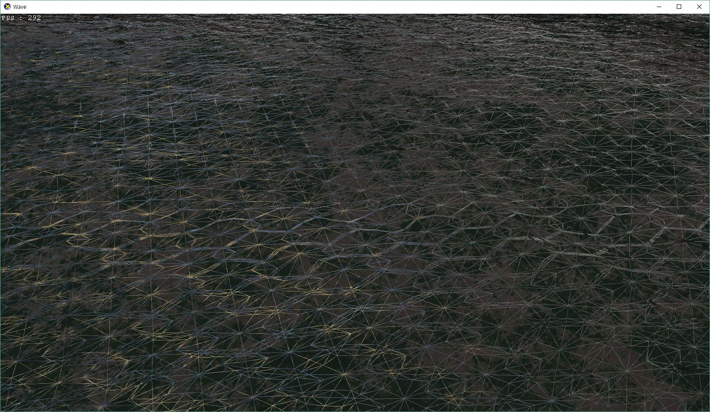

# Wave

## Tessellation 
- Pixels per edge approach(sphere diameter in clip space). Not by distance.
- Frustum culling tessellation (Discard faces outside frustum). 

## Normal mapping & Displacement
- Used 2 textures for normal mapping and height displacement.
- RGB for normal, alpha channel for height.
- Texture coordinates are scaled and translated.

## Cubemap
- Sky sphere.
- Wave reflection from cubemap.

## Lighting
- One directional light with diffuse, Fresnel effect, Specular.

## Controls
- W, A, S, D for camera move (Hold LShift for slow moving)
- 1 - switch tessellation camera to teapot.
- 2 - switch tessellation camera to real camera.
- 3 - wireframe drawing mode.
- 4 - cull counter clockwise drawing mode.
- 5 - Enable frustum culling.
- 6 - Disable frustum culling.

## Etc
- Need DirectXTK in $(SolutionDir)/../DirectXTK to build & run.

